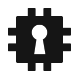

<p align="center">
  <picture>
    <source media="(prefers-color-scheme: dark)" srcset="assets/logo/factorseal-mark-paper.svg">
    
  </picture>
</p>

<h1 align="center">FactorSeal</h1>

<p align="center">
  <a href="https://github.com/domenkozar/factorseal/actions/workflows/ci.yml"></a>
  <a href="LICENSE"></a>
  
</p>

> [!WARNING]
> FactorSeal is an unaudited prototype. It is not ready for production secrets.

FactorSeal is a hardware-backed vault for personal passwords and application
secrets. Manage logins, notes, and other personal records in Desktop, or give
local applications scoped access to project secrets and keyring entries.
Secrets are encrypted on your device, with vault unlock protected by TPM 2.0
on Linux and Windows or Apple's Secure Enclave on macOS.

## Features

- **Personal secrets:** typed records for logins, notes, cards, identities,
  SSH keys, and API credentials, with custom fields and masked input.
- **Application secrets:** durable project secrets through the CLI, a native
  application keyring, a disposable SecretSpec provider cache, and Linux
  Secret Service integration.
- **Access controls:** the vault service authenticates calling executables and
  checks grants for the requested secrets and operations.
- **Import and backup:** import Bitwarden, 1Password, and KeePass export formats;
  create encrypted FactorSeal archives for portable backup and restore.
- **Experimental personal sync:** pair devices in Desktop and exchange encrypted
  personal-item changes. See the [sync limitations](docs/usage.md#personal-sync-experimental).

Browser autofill, usable passkeys, auto-type, TOTP code generation, and SSH-agent
integration are not currently provided.

## Quick start

A TPM 2.0 (Linux/Windows) or Secure Enclave (macOS) is required; there is no
software-only fallback. Password unlock is supported on all three platforms.
Biometric unlock uses Touch ID on macOS or Windows Hello on Windows.

### Desktop

Install Desktop and its required CLI companion using the
[development packaging instructions](packaging/README.md), then launch:

```console
$ factorseal desktop
```

Desktop guides you through creating and unlocking a vault. Use it to manage
personal secrets, approve application access, and seal the vault from the window
or tray. Desktop hosts the vault service; run one of Desktop or `factorseal agent`
at a time.

### CLI

Install the CLI using the [development packaging instructions](packaging/README.md).
Create a vault and start its service:

```console
$ factorseal init
$ factorseal agent
```

With the service unsealed, use another terminal to store and retrieve a secret:

```console
$ factorseal set --project my-app github --field token
$ factorseal get --project my-app github --field token
$ factorseal seal
```

`set` prompts without echo. Applications need access grants before using secrets;
initialization authorizes the CLI executable. See the
[usage guide](docs/usage.md) for unlock policies, approvals, imports, and backups.

## Security and project status

The native vault is bound to your device's hardware keys. A copy of its database
and configuration cannot replace a portable backup after hardware loss.
[Export an encrypted archive](docs/usage.md#import-and-export) beforehand.

Application grants provide defense in depth. A compromised authorized client
can disclose secrets it receives, and hardware binding does not protect against
code execution inside the unsealed worker. Whole-vault rollback detection is
outside the current security claim. See the [security model](SECURITY.md).

FactorSeal remains an unaudited prototype. Independent security review, physical
hardware acceptance across the release matrix, signed release artifacts, and
end-to-end SecretSpec conformance remain outstanding. See the
[release status](docs/development.md#release-status) and
[security release gates](acceptance/security-release-gates.md).

## Documentation

- [Usage guide](docs/usage.md): unlock, CLI, personal records, imports, sync, diagnostics.
- [Desktop](factorseal-desktop/README.md): graphical host and desktop integration.
- [Architecture](docs/architecture.md): key hierarchy, storage, IPC, integrations, lifecycle.
- [Development](docs/development.md): build, test, and release requirements.
- [Packaging](packaging/README.md): platform packages and installation.
- [Security](SECURITY.md): threat model, limitations, and vulnerability reporting.

## License

Apache-2.0. See [LICENSE](LICENSE).
